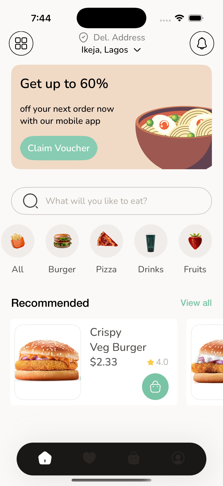

<h3>Food Ordering App - UIKit</h3>

Food Ordering App - UIKit is a simple app that design to code.
   
<h3>Tech Used</h3>

<ul>
  <li>Designed with MVVM architecture</li>
  <li>Swift 5</li>
  <li>UIKit</li>
  <li>XCode 15</li>
</ul>
  

<h3>Screens</h3>

